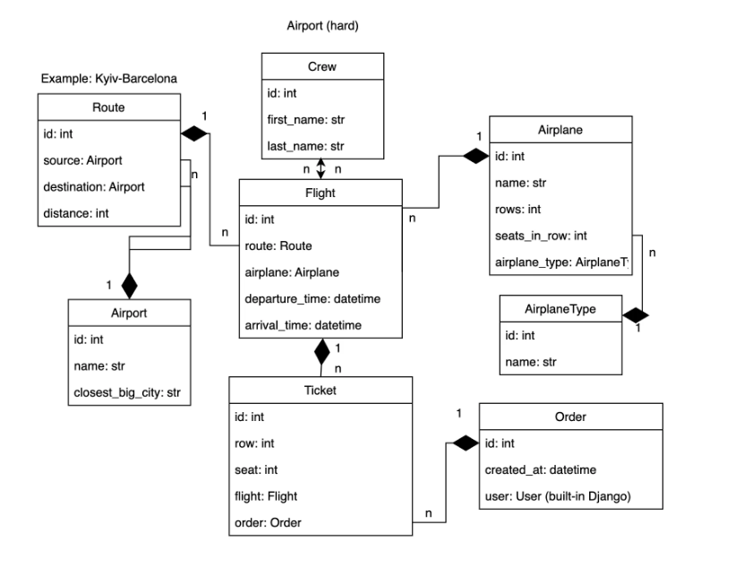

### Airport API system
API service for airport management written in DRF
## Installing using GitHub
Install PostgreSQL & create db

  - git clone https://github.com/Serhii-Chubur/airport-api.git
  - cd airport-api
  - python -m venv venv
  - venv/bin/activate
  - pip install -r requirements.txt
  - copy .env.sample to .env & fill it up
  - python manage.py migrate
  - python manage.py createsuperuser
  - python manage.py loaddata data.json
  - python manage.py runserver

## Run with Docker
- Docker should be installed
  - docker-compose build
  - docker-compose up

## Getting access
- Create user: user/register
- Get access token: user/token
- Get info about user: user/me

## Features
- JWT authentication
- Admin panel: /admin
- Get documentation: api/schema/
- Managing: order & tickets
- Creating: airplane types, airplanes, routes, airports, flights & crew
- Filtering: routes, flights & airplanes
### DB structure

